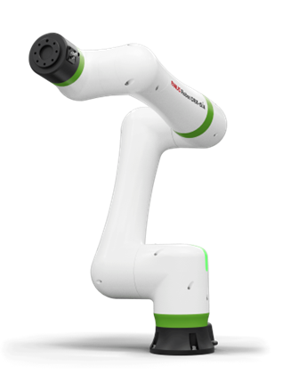
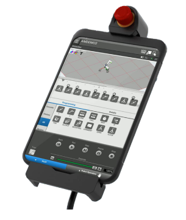
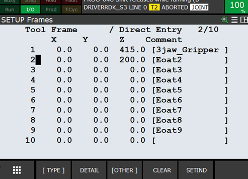
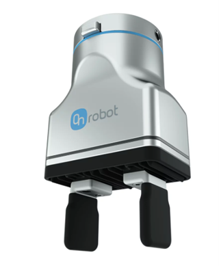

Ce TP concerne le Cobot CRX-10iA

Nous avons perdu beacoup de temps sur ce TP, en effet nous avons rencontré beaucoup de difficultés qui seront énoncées par la suite. Cependant, le fait d'avoir commencé avec ce TP nous a permis de trouver les suivants plus simple et avencer plus rapidement. 

## Difficultés observées 

    - Positions de singularité 
    - Problème d’interface (nouvelle) 
    - Problème de connexion avec la tablette (tool up) 
    - Switcher constamment avec la nouvelle et l’ancienne interface (On se perd entre les deux avec une action dans l’une puis une dans l’autre) 
    - Non suppression des données 
    - Menu différents donc compliqué de se repérer  
    - Mode tactile et non tactile 
    - Bug entre les programmes 
    - Manipulation du robot (warning error force, reset, bouton) 
    - Utilisation de la pince 
    - Programmation ancienne interface compliquée (codage) 

Positions de singularité : 

Tout au long de notre projet, dans n’importe quelle position notre robot venait toujours se bloquer en position de singularité (un des axes était au maximum). Cela s’est produit en mode libre mais surtout sur des mouvements basiques comme des déplacements linéaires censés être des mouvements simples. Dès lors que nous exécutions notre programme dans n’importe quelle position le robot venait à s’arrêter presque instantanément même en modifiant le type de mouvement, la complexité du mouvement et l’endroit où était exécuté le mouvement. 

 

Problème d’interface (Non-suppression des données) :  

Maintenant le problème qui nous a fait perdre le plus de temps a pour sûr été le fait de l’inefficacité de la nouvelle interface qui dans certains cas se trouve très utile pour mieux visualiser avec une meilleure l’ergonomie et une facilité d’utilisation. Malheureusement cette interface a fait tout l’inverse. Pour certaines rares utilisations elle s’est trouvée fort intéressante mais pour la majorité des fonctions essentielles (coordonnées, programmation, repère outil, repère utilisateur, sélection et édition des programmes…) elle nous a plutôt ralentie. 

Sur cette image, on peut voir la nouvelle interface, celle-ci est donc plus facile d’utilisation et plus ergonomique. De plus, sur la partie supérieure nous avons une visualisation 3D de l’appareil que nous n’avons pas sur l’ancienne interface. Malheureusement celle-ci est impossible à exploiter car les cases qui représentent des fonctions dans lesquelles on vient rentrer les variables ne fonctionnent pas ou plus précisément ne sont pas utilisable en tant que programme. Elles sont rattachées à une seule position donnée qui ne peut être changée à notre guise. Cela rend ainsi l’utilisation du code impossible à utiliser sur de multiples positions.

Ainsi pour le repère « user » et « tool » nous avons bloqué pendant plusieurs séances pour trouver notre erreur car les repères ne correspondaient pas à ceux que nous avons initialisé après plusieurs essais nous avons déterminé que les informations rentrées qui sont à la base de l’utilisation du robot n’étaient pas prises en compte par celui-ci. La solution à notre problème a été d’aller au niveau de l’ancienne interface du fanuc pour aller supprimer manuellement les positions enregistrées dans l’étape d’initialisation des repères, autrement dit, aller supprimer les valeurs contenues dans chacun des repères déjà configurés. Cette découverte nous a permis de comprendre le fonctionnement de ce robot afin de le faire fonctionner au mieux, il faut fréquemment rebasculer sur l’ancienne interface. Car la nouvelle n’est pas encore tout à fait au point. 

 

Problème de connexion avec la tablette (tool up) : 

Une perte de temps importante a été causée par le fait que la tablette n’était pas correctement liée avec le robot et de nombreux problèmes de connexion se sont présentés au lancement du robot à chaque séance. 

 

Manipulation du robot (warning error force, reset, bouton) : 

 

Le cobot a pour but d’être interactif et ludique afin de permettre une prise en main facile pour les personnes en formation dans le domaine de la robotique et de la mécanique. En effet, nous avons pu le remarquer sur les autres cobots de la mini-usine qui sont beaucoup plus simple à prendre en main que celui-ci. Le CRx-10ia quant à lui est tout l’inverse dès que nous tentions de le manipuler de nombreuses erreurs apparaissaient sans raisons apparentes entre le bouton de sécurité, la force, le mode free, le mode robot, le mode tactile, le mode non tactile les resets incessant qui viennent constamment empêcher et restreindre notre avancée et notre apprentissage sur la machine. Au globale, en l’état cette machine n’est pas du tout intuitive ni ergonomique et je ne la conseille pas du tout pour la prendre en main cela demande de temps beaucoup à régler des erreurs rarement utiles à résoudre et souvent inhérentes à la machine elle-même. 

 

Menu différents dur de se repérer : 

Dans cette continuité, il est dur de se repérer au sein de l’application fanuc car il faut s’habituer aux différents menus qui permettent d’utiliser soit l’ancienne interface soit la nouvelle. Premièrement il faut comprendre ce fonctionnement ensuite il faut se repérer et identifier chaque action en fonction de son interface afin de progresser le plus rapidement possible dans les tâches qui nous ont été données. Il est ainsi compliqué d’effectuer les actions avec une certaine fluidité, ce ralentissement est assez frustrant dans la compréhension  

 
Utilisation de la pince : 

Comme la pince préhension du robot était utilisé par d’autres groupes d’élèves sur des robots différents cela a été un peu plus complexe à utiliser car à chacune des séances nous devions l’enlever et le remettre sur notre bras robot. De plus, le tube/alimentation pneumatique de la pince n’était malheureusement pas parfaitement adapté à notre robot car le tube était soit trop long soit trop court. 

Enfin nous avons eu dans les premières séances du mal à déterminer où était situé le dispositif de commande de la pince au niveau de l’interface du FANUC. 

 

Prise en main de l’interface de code 

 

Cette partie bien que fastidieuse a été intéressante dans l’apprentissage du code et dans l’exploitation de nos connaissances et compétences en mécanique bien que l’interface reste assez archaïque ce qui vient nous faire perdre du temps en plus sur comment trouver et comprendre les commandes plus que sur la réflexion et sur le code en lui -même et les commandes à choisir. 

Cette partie nous a quand même permis d’utiliser notre compréhension sur les notions de coordonnées, offset, les types de mouvements, les marqueurs, les indices… 

 

 

En conclusion, avec ce robot nous avons réussi à faire les manipulations classiques à réaliser sur chacun des robots comme set le repère « user » et « tool » non sans difficultés ensuite nous avons essayé d’effectuer un programme pour que le robot puisse répéter dans un premier temps le motif élémentaire d’un carré afin de produire et dessiner un cadrillage malheureusement nous nous sommes heurtés à de nombreux obstacles ce qui nous a empêché de finir cette tâche. 