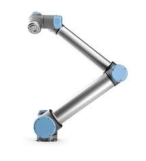
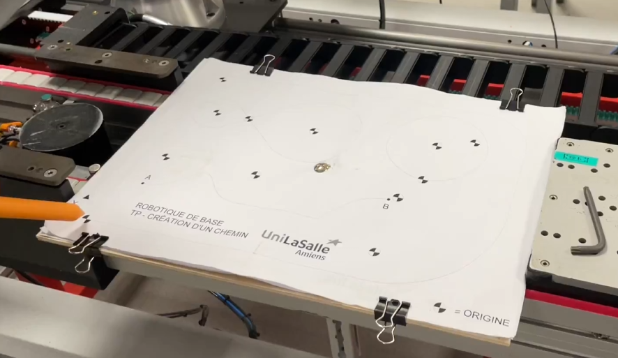
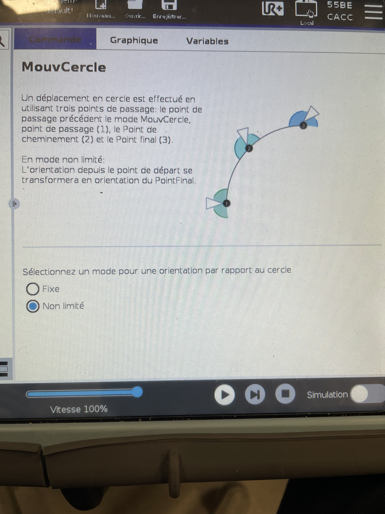

## INTRODUCTION

Pour ce TP3, nous allons travailler sur le robot UR10e.
Avec celui-ci nous devons réaliser un circuit sur une feuille en faisant appel à une
création de programme avec des trajectoires afin qu’il puisse réaliser différents
chemins.

Notre première étape fut de prendre en main le robot en prenant des repères
utilisateurs puis simplement le manipuler pour voir ses limites et son utilisation.

Durant cette phase nous avons pu chacun de nous, en apprendre beaucoup sur ce
robot. Une fois cette étape validée, nous avons commencé à regarder le tutoriel vidéo
mis à disposition via l’énoncé de TP. Celui-ci nous a permis d’avoir les bases de
programmation et des clés pour former une trajectoire adéquat et souple. 

Au tout début des séances de TP nous avons appris à créer des repères utilisateurs et outils sur ce robot.

<video src="img/verif_repere_outil.mp4" controls title="Title"  style="width: 100%;" muted></video>

Sur cette vidéo, nous pouvons voir que le repère outil est bien configuré puisque lorsque nous déplaçons le robot sur l'axe Z, il se déplace dans la direction de l'outil, donc la direction qui est pointée par le crayon.

## OBJECTIFS

Comme énoncé dans l'introduction, le but de ce TP est de réaliser un circuit sur une feuille. Pour cela, nous devons programmer le robot UR10e afin qu'il puisse réaliser fluidement les trajectoires dessinées.
Voici le circuit :

Nous avons donc une grande trajectoire à réaliser sur le contour de la feuille et plusieurs petites trajectoires au centre.

Nous devons également réaliser un autre circuit mais cette fois à la verticale. Cependant, l'outil pour réaliser ce TP n'était pas présent lorsque nous travaillions dessus et le fonctionnement étant à peu près le même que pour le circuit à l'horizontal, nous avons décidé d'y revenir plus tard.

## Travail réalisé

Lorsque nous programmons ce robot, nous pouvons utiliser plusieurs type de déplacement : déplacement linéaire par exemple, qui va effectuer des mouvements rectilignes entre deux points. Nous avons décidé d'utiliser le "déplacementP" afin d'ajouter des mouvement circulaires à notre tajectoire. Nous avons pour objectif de réaliser un mouvement fluide, il faut donc placer tous les mouvements à l'intérieur d'un seul déplacement. En effet, si nous utilisons plusieurs déplacement, même s'il s'agit du même type, le robot va faire une pause entre les deux déplacements et casser la fluidité de la trajectoire.
Nous avons donc le programme suivant :

Dans ce programme, nous retrouvons bien notre "déplacementP" qui va contenir tous les mouvement du robot. Ensuite nous n'avbons qu'à enregistrer les points de passage que le robot va devoir atteindre. Pour ce qui est des mouvement circulaires, une fonction est disponible pour cela. Nous devons juste ajouter des points de passage afin que le programme calcul lui même sa trajectoire.

Par exemple, si nous prenons dans notre programme le premier mouvement circulaire, le "PointPassage2" est l'entrée de l'arc de cercle et le "PointVoie_1" est un point situé au centre de l'arc de cercle. Pour finir, le "PointFinal_1" est un point situé à la fin de l'arc. Grâce à ces 3 points, le programme a ce qu'il lui faut pour calculer la tajectoire que devra emprunter le robot.

Il faut faire attention à bien cocher le mode d'ortientation "non limité" lorsque nous ajoutons un mouvement circulaire; En effet, si on coche le le mode "fixe", le robot ne suit pas du tout la trajectoire de l'arc de cercle. Cependant, nous n'avons pas vraiment compris pourquoi. 

Grâce à ce programme, nous avons le résultat suivant :

<!--<video src="img/deplacement_grand_cercle_ur.mp4" controls title="Title"  style="width: 100%;" muted></video>-->
<video id="myVideo" src="img/deplacement_grand_cercle_ur.mp4" controls autoplay muted loop style="width: 100%;"></video>

